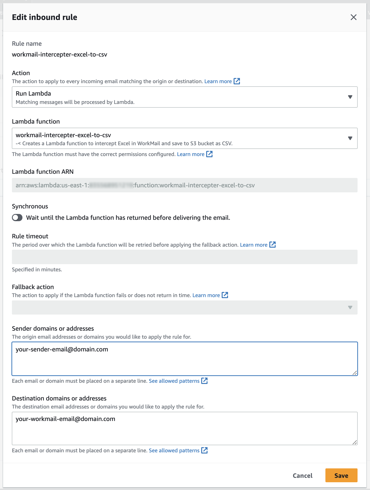
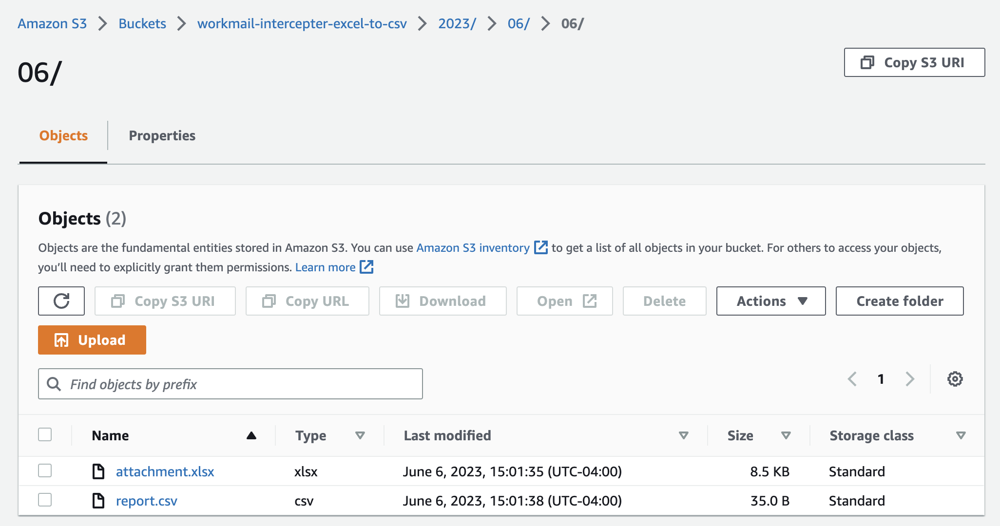

# workmail-intercepter-excel-to-csv

## Transform incomig AWS Workmail email with Excel attachement to CSV and save to S3 bucket

### Goals
- Automate data ingestion when it's delivered by email
- Transform the data before storage

### Prerequsites
- Workmail email
- An existing S3 bucket to hold the CloudFormation template and Lambda source code
- An exsiting S3 bucket to hold the files

### Limitation of the code
- The Lambda included on process one Excel attachment in .xlsx format. You can extend the code to process any number of attachments in any format.
- If you do have a lot of attachements, recommended way is to only download the files and send messages to SQS to have a separate Lambda to transform the data.

### Lambda Layers
We will be using Lambda layers below from [Klayers](https://github.com/keithrozario/Klayers):
- pandas
- numpy
- openyxl

### Lambda Deployment
#### Modify `template.yaml`
```
Parameters:
  AppName:
    Type: String
    Default: workmail-intercepter-excel-to-csv
    Description: The application name.

  OriginFile:
    Type: String
    Default: attachment.xlsx
    Description: -<
      The name of the original file.
      It can be any name but must ends with .xlsx extension.

  DestinationFile:
    Type: String
    Default: report.csv
    Description: -<
      The file name to save in the S3 bucket. Must ends with .csv extension.

  DestinationBucket:
    Type: String
    Default: workmail-intercepter-excel-to-csv
    Description: The destination bucket.

  WorkMailOrganizationId:
    Type: String
    Default: REPLACE-ME
    Description: The WorkMail organization ID.
```

#### Modify `deploy.sh`
````
#!/bin/bash

CLOUDFORMATION_BUCKET=your-own-cloudformation-bucket
STACK_NAME=workmail-intercepter-excel-to-csv
PROFILE=default
REGION=us-east-1
````

#### Run `./deploy.sh`

### WorkMail configurations
Go to __Amazon WorkMail__ :: __Organization Settings__ :: __Inbound rules__ :: __Create new inbound rule__ as screenshot below.



### Finally
Send a test email with .xslx attachment to your WorkMail email. You should have the attachment file automatically intercepted, tranformed, cataloged and saved to S3.



#### Credits
- Python layers: [https://github.com/keithrozario/Klayers](https://github.com/keithrozario/Klayers)
- Processing Email Attachments with AWS: [https://medium.com/caspertechteam/processing-email-attachments-with-aws-a35a1411a0c4](https://medium.com/caspertechteam/processing-email-attachments-with-aws-a35a1411a0c4)